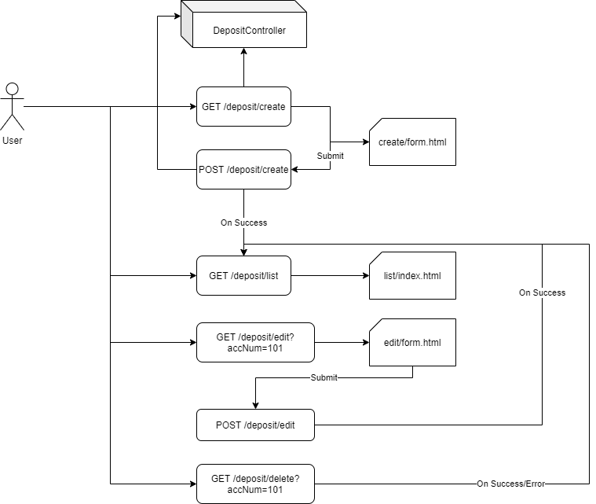

# End to End demo with Spring WebMVC, Spring Data-JPA and Spring Boot

## Application Architecture 

 

## Dependencies

* spring-boot-starter-web
* spring-boot-starter-thymeleaf
* spring-boot-starter-data-jpa
* spring-boot-starter-devTools
* h2database (Can be replaced with Oracle or MySQL)

## Create a new Spring Starter project with all required dependencies

1. Model class `Deposit`

    ```java
    @Entity //An Object which is LINKED to DB Table
    @Table(name="deposits") //Name of Linked Table
    public class Deposit {
        
        @Id @Column(name="acc_id")
        private Integer accNumber;
        
        @Column(name="cust_name",length = 25)
        private String custName;
        
        @Column(name="amount",precision = 2, scale = 15)
        private Double amount;
        //Getters, Setters & Constructors...
    ```

2.  Modify my `application.properties`

    ```ini
    spring.datasource.url=jdbc:h2:mem:db1
    spring.datasource.username=hr
    spring.datasource.password=hr
    spring.datasource.driver-class-name=org.h2.Driver
    ## instruct hibernate (ORM) to create all SQL Queries compatible with H2 Database
    spring.jpa.database-platform=org.hibernate.dialect.H2Dialect
    ## DEBUG : display generated SQL queries in CONSOLE
    spring.jpa.show-sql=true
    ## Create the TABLES on-the-fly!!!!
    spring.jpa.generate-ddl=true
    spring.h2.console.enabled=true
    ```

3.  Create Repository Interface `DepositRepository`

    ```java
    import org.springframework.data.repository.CrudRepository;
    import org.springframework.stereotype.Repository;

    import com.mahendra.mvcproject.models.Deposit;

    @Repository
    public interface DepositRepository extends CrudRepository<Deposit, Integer>{

    }
    ```

4.  Create the Service class `DepositService`

    ```java
    import java.util.LinkedList;
    import java.util.List;

    import org.springframework.beans.factory.annotation.Autowired;
    import org.springframework.stereotype.Service;

    import com.mahendra.mvcproject.daos.DepositRepository;
    import com.mahendra.mvcproject.models.Deposit;

    @Service
    public class DepositService {

        @Autowired
        private DepositRepository dao;
        
        public Deposit save(Deposit deposit) {
            return dao.save(deposit);
        }
        
        public Deposit update(Deposit deposit) {
            return dao.save(deposit);
        }
        
        public void delete(int id) {
            dao.deleteById(id);
        }
        
        public List<Deposit> getAll(){
            List<Deposit> deposits = new LinkedList<>();
            dao.findAll().forEach(deposit -> deposits.add(deposit));
            return deposits;
        }
    }

    ```